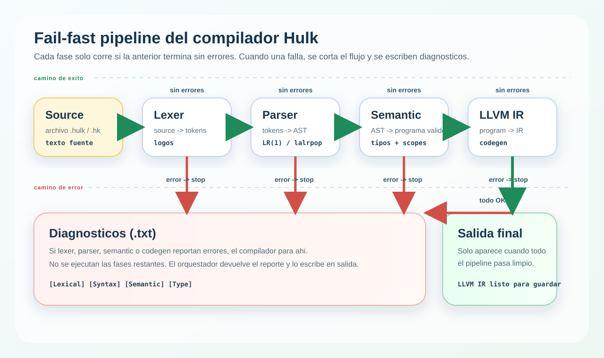

# Hulk Compiler

Compilador en Rust organizado por fases, con salida a archivo `.txt`.

Pipeline actual (fail-fast: si falla una fase no se ejecutan las siguientes):

```text
lexer -> parser (LR1) -> semantic -> LLVM IR
```



Cada fase alimenta a la siguiente. Si una fase encuentra errores, el compilador corta ahi y escribe diagnosticos en vez de seguir avanzando.

Extensión de código fuente recomendada: `.hulk` (la CLI acepta también `.hk`).

Notas rápidas del lenguaje:

- Es **basado en expresiones**: cualquier expresión puede ser un `Statement`. El último `;` es opcional en programas y bloques.
- Los bloques `{ ... }` y las expresiones `let ... in ...` devuelven el valor de su última expresión.
- `while (cond) { ... }` es una expresión de loop y devuelve `Unit`.

## 1. Arquitectura del proyecto

```text
src/
  lexer/                  # Analisis lexico con logos
  parser/                 # Analisis sintactico LR(1) con lalrpop + AST
  semantic/               # Reglas de tipos y validaciones semanticas
  codegen/
    llvm/                 # Backend LLVM IR
    mod.rs                # Trait para backends futuros
  compiler/               # Orquestador del pipeline
  error/                  # Error unificado (categoria + linea + columna + mensaje)
  runner/                 # Integracion clang/ejecucion nativa
  main.rs                 # CLI
```

## 2. Flujo del compilador

### Fase 1: Lexer (`src/lexer`)

Implementado con `logos`.

Responsabilidades:

- Convertir el texto fuente en `Token`s.
- Reportar errores lexicos con linea/columna.
- Continuar escaneando despues de un token invalido para recolectar todos los errores de la fase.

Comportamiento de error:

- Si hay al menos un error lexico, no se ejecuta parser/semantic/codegen.
- Se escribe un `.txt` de diagnosticos.

### Fase 2: Parser LR(1) (`src/parser`)

Implementado con `lalrpop`.

Responsabilidades:

- Construir AST (`Program`, `Statement`, `Expr`).
- Aplicar precedencia y asociatividad de operadores.
- Reportar errores sintacticos con contexto.

### Fase 3: Semantic (`src/semantic`)

Responsabilidades:

- Validar declaraciones/uso de variables.
- Validar tipos en operadores y builtins.
- Entregar errores tipados (`Type`/`Semantic`) con linea/columna.

### Fase 4: LLVM IR (`src/codegen/llvm`)

Responsabilidades:

- Generar LLVM IR cuando no hay errores previos.
- Emitir IR para literales, variables, unary/binary ops, builtins y `print`.

## 3. Lexer: tokens soportados

### Keywords reservadas

- `let`
- `print`
- `PI`
- `E`
- `sin`
- `cos`
- `sqrt`
- `exp`
- `log`
- `rand`
- `in`
- `while`
- `true`, `false`

### Literales

- Numero: `123`, `45.67`
- String: `"hola"`
- Boolean: `true`, `false`

### Operadores

- Aritmeticos: `+`, `-`, `*`, `/`, `^`
- Concatenacion: `@`
- Asignacion: `=`
- Asignacion destructiva: `:=` (expresion que sobrescribe y devuelve el valor)
- Comparacion: `==`, `!=`, `<`, `>`, `<=`, `>=`
- Logicos: `&&`, `||`, `!`

### Delimitadores

- `(` `)` `{` `}` `,` `;`

### Escapes en string implementados actualmente

- `\"` (comilla)
- `\n` (newline)
- `\t` (tab)

## 4. Gramatica completa (resumen EBNF)

```ebnf
Program        := Statements? EOF

Statements     := Statement (";" Statement)* ";"?

Statement      := "let" Identifier "=" Expr
                | Identifier "=" Expr
                | "print" "(" Expr ")"
                | Expr

Expr           := LetIn

LetIn          := "let" LetBindings "in" LetIn
                | Assignment

LetBindings    := LetBinding ("," LetBinding)*
LetBinding     := Identifier "=" Expr

Assignment     := Identifier ":=" Assignment
                | LogicalOr

LogicalOr      := LogicalOr "||" LogicalAnd
                | LogicalAnd

LogicalAnd     := LogicalAnd "&&" Equality
                | Equality

Equality       := Equality "==" Comparison
                | Equality "!=" Comparison
                | Comparison

Comparison     := Comparison "<" Term
                | Comparison ">" Term
                | Comparison "<=" Term
                | Comparison ">=" Term
                | Term

Term           := Term "+" Factor
                | Term "@" Factor
                | Term "-" Factor
                | Factor

Factor         := Factor "*" Unary
                | Factor "/" Unary
                | Unary

Unary          := "!" Unary
                | "-" Unary
                | Power

Power          := Primary "^" Unary
                | Primary

Primary        := Block
                | While
                | BuiltinCall
                | Literal
                | Identifier
                | "(" Expr ")"

Block          := "{" Statements? "}"
While          := "while" "(" Expr ")" Block

BuiltinCall    := "sin"  "(" Expr ")"
                | "cos"  "(" Expr ")"
                | "sqrt" "(" Expr ")"
                | "exp"  "(" Expr ")"
                | "log"  "(" Expr "," Expr ")"
                | "rand" "(" ")"

Literal        := "PI"
                | "E"
                | Number
                | String
                | Boolean
```

Apuntes gramaticales:

- `LetIn` es **asociativo a la derecha**: `let a = 1 in let b = 2 in a + b`.
- Se permiten varias ligaduras en `let ... in ...`: `let a = 1, b = 2 in a + b`.
- Un bloque `{ ... }` es una expresión y su valor es la **última sentencia/expresión** que contiene.
- Un `while` es una expresión cuyo cuerpo debe ser un bloque y cuyo resultado es `Unit`.

## 5. Precedencia y asociatividad

De mayor a menor precedencia:

1. Primarios: literales, identificadores, `(...)`, builtins (`sin(...)`, `log(...)`, etc.)
2. Potencia: `^` (asociativa a derecha)
3. Unarios: `!`, `-`
4. `*`, `/`
5. `+`, `@`, `-`
6. `<`, `>`, `<=`, `>=`
7. `==`, `!=`
8. `&&`
9. `||`
10. Asignación destructiva `:=` (asociativa a derecha)

Notas:

- `^` es asociativo a derecha (`2 ^ 3 ^ 2` se interpreta como `2 ^ (3 ^ 2)`).
- El resto de operadores binarios son asociativos a izquierda.
- La asignacion (`x = ...;`) es sentencia, no expresion.
- El lenguaje acepta statement de expresion (`42`, `x + 1`, `rand()`).
- El ultimo `;` es opcional tanto en el programa como dentro de bloques.

## 6. Reglas semanticas actuales

### Variables

- `let x = expr;` declara `x`.
- `x = expr;` reasigna `x` (debe existir previamente).
- Si se reasigna una variable declarada, por ahora se permite cambiar el tipo.
- Los bloques `{ ... }` crean un nuevo scope léxico: las variables declaradas dentro no son visibles fuera. Se permite shadowing en un scope interno pero no redeclarar en el mismo nivel.
- Un bloque es una **expresión**: su valor es el de la última sentencia/expresión evaluada dentro del bloque.
- `let ... in ...` también crea un scope: las ligaduras solo viven dentro del cuerpo y se evalúan en orden. Es asociativo a la derecha.
- Asignación destructiva `:=` (expresión): sobreescribe una variable ya declarada y devuelve el valor asignado. Requiere que el tipo coincida con el declarado en ese scope.

### Reglas de nombres (identificadores)

- Deben comenzar con letra (`a-zA-Z`).
- Pueden contener letras, dígitos y guión bajo después del primer carácter.
- No pueden comenzar con `_` ni con dígitos. Ejemplos válidos: `x`, `x0`, `x_0`, `snake_case`, `camelCase`. Ejemplos inválidos: `_x`, `8ball`, `x+y`.

Ejemplo valido:

```hulk
let x = 45;
x = true;
x = log(2, 8);
print(x);

let y = 1;
let result = { let x = 9; let z = 1; x + y };
print(result); // imprime 10
```

### Tipos soportados

- `Number`
- `Boolean`
- `String`
- `Unit`

### Reglas por operador

- `+ - * / ^`: `Number x Number -> Number`
- `@`: `(String,String) | (String,Number) | (Number,String) -> String`
- `< > <= >=`: `Number x Number -> Boolean`
- `== !=`: ambos operandos del mismo tipo (`Number`, `Boolean`, `String`) -> `Boolean`
- `&& ||`: `Boolean x Boolean -> Boolean`
- Unary `-`: `Number -> Number`
- Unary `!`: `Boolean -> Boolean`
- `while (Boolean) { ... } -> Unit`
- `Unit` no participa en operadores aritméticos, lógicos, de concatenación ni comparación

### Builtins matematicas

- `print(T) -> Unit` para `T != Unit` (imprime y devuelve `Unit`)
- `sin(Number) -> Number`
- `cos(Number) -> Number`
- `sqrt(Number) -> Number`
- `exp(Number) -> Number`
- `log(Number, Number) -> Number`
- `rand() -> Number` (uniforme en `[0, 1]`)

### Constantes globales

- `PI` (Number)
- `E` (Number)

## 7. LLVM IR generado

Si no hay errores, se escribe LLVM IR en el `.txt` indicado.

Incluye declaraciones para:

- `printf`, `asprintf`, `strcmp`, `rand`, `time`, `srand`
- `@llvm.sin.f64`, `@llvm.cos.f64`, `@llvm.sqrt.f64`, `@llvm.exp.f64`, `@llvm.log.f64`, `@llvm.pow.f64`

Si hay errores, el `.txt` contiene diagnosticos y no IR.

## 8. Formato de diagnosticos

```text
Hulk Compiler Diagnostics
========================
1. [Type] [Semantic] line X, column Y: mensaje
```

Categorias posibles:

- `Lexical`
- `Syntax`
- `Type`
- `Semantic`

## 9. Comandos de uso

Compatibilidad: usa archivos `.hulk` como predeterminado; la CLI sigue aceptando `.hk` para compatibilidad hacia atrás, pero los ejemplos se distribuyen con `.hulk`.

### Compilar un archivo `.hulk` a `.txt`

```bash
cargo run -- --input examples/calculator_ok.hulk --emit-ir artifacts/output.txt
```

### Compilar todos los `.hulk` de una carpeta

```bash
cargo run -- --run-all examples --emit-dir artifacts/batch
```

### Compilar a ejecutable nativo y ejecutar

```bash
cargo run -- run examples/calculator_ok.hulk
```

#### Windows (requisitos y salida)

Para generar `.exe` necesitas `clang` instalado y en el `PATH`.
Verifica con:

```powershell
where.exe clang
```

Si no aparece, instala LLVM (que incluye `clang`) o pasa la ruta explícita:

```powershell
cargo run -- run examples/calculator_ok.hulk --clang "C:\Program Files\LLVM\bin\clang.exe"
```

Si ejecutas por lotes en Windows, los `.exe` se generan en:

```text
artifacts\program\*.exe
```

Para ejecutar un `.exe`:

```powershell
.\artifacts\program\calculator_ok.exe
```

Opciones utiles del comando `run`:

```bash
cargo run -- run examples/calculator_ok.hulk --no-exec
cargo run -- run examples/calculator_ok.hulk --opt-level 3
cargo run -- run examples/calculator_ok.hulk --emit-ir artifacts/demo.ll --out artifacts/demo_bin
cargo run -- run examples/calculator_ok.hulk -- arg1 arg2
```

### Ejecutar IR manualmente

Si tienes `lli` instalado:

```bash
lli artifacts/output.txt
```

Alternativa con `clang`:

```bash
clang -x ir artifacts/output.txt -o artifacts/program
./artifacts/program
```

## 10. Tests por fase

Orden recomendado (fase por fase):

```bash
cargo test -q lexer::
cargo test -q parser::
cargo test -q semantic::
cargo test -q compiler::
```

Suite completa:

```bash
cargo test -q
```

## 11. Ejemplos recomendados

Validos:

- `examples/calculator_ok.hulk`
- `examples/reassignment_ok.hulk`
- `examples/builtin_math_ok.hulk`
- `examples/power_ok.hulk`
- `examples/rand_ok.hulk`
- `examples/expression_statement_ok.hulk`
- `examples/block_scope_ok.hulk`
- `examples/let_in_ok.hulk`
- `examples/let_in_shadow.hulk`
- `examples/destructive_assign_ok.hulk`
- `examples/print_expr_ok.hulk`

Con error (para validar diagnosticos):

- `examples/builtin_math_type_error.hulk`
- `examples/power_type_error.hulk`
- `examples/rand_invalid_args.hulk`
- `examples/error_lexical_invalid.hulk`
- `examples/error_syntax_missing_semicolon.hulk`
- `examples/error_type_mismatch_add.hulk`
- `examples/let_in_type_error.hulk`
- `examples/let_in_parser_error.hulk`
- `examples/destructive_assign_type_error.hulk`
- `examples/identifier_invalid.hulk`

## 12. Extender el proyecto

Para anadir nuevos features sin romper arquitectura:

- Lexer: agregar token en `src/lexer/token.rs` y reglas en `src/lexer/mod.rs`.
- Parser: extender AST en `src/parser/expression.rs` y gramatica en `src/parser/grammar.lalrpop`.
- Semantic: definir reglas en `src/semantic/mod.rs`.
- Codegen: emitir IR en `src/codegen/llvm/mod.rs`.
- Tests: agregar tests en `src/<fase>/tests/` (`lexer`, `parser`, `semantic`, `compiler`).

Regla practica: cada feature nuevo debe incluir tests de fase y un ejemplo `.hulk`.

## 13. GUI prototipo (eframe/egui)

Hay un binario opcional para probar el compilador con interfaz gráfica.

```bash
cargo run --bin gui
```

Funciones:

- Editor de código a la izquierda.
- Barra superior con lista de ejemplos de `examples/*.hulk` (ComboBox) y campo para ruta custom; botón **Cargar**.
- **Compilar** genera LLVM IR y muestra tokens, AST, errores e IR.
- Ejecuta automáticamente el IR con `lli` y enseña stdout/stderr en la sección **Salida lli**; puedes editar la ruta de `lli` o re-ejecutar.
- Botón **Demo rápida** carga un snippet de ejemplo.

### Cómo instalar `lli` (Unix)

- macOS (Homebrew): `brew install llvm` y luego agregar a tu PATH  
  `echo 'export PATH="/usr/local/opt/llvm/bin:$PATH"' >> ~/.zshrc` (ajusta si usas bash o Apple Silicon con `/opt/homebrew`).
- Ubuntu/Debian: `sudo apt update && sudo apt install llvm` (opcional: `llvm-15` o la versión disponible en tu repo).
- Arch/Manjaro: `sudo pacman -S llvm`.
- Verifica: `lli --version` debería mostrar la versión instalada.
