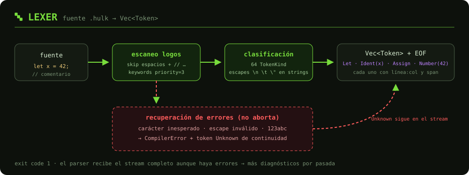
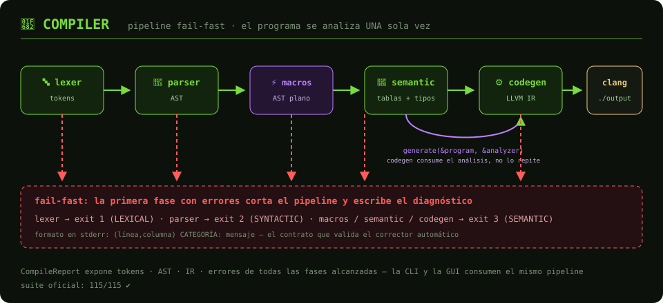
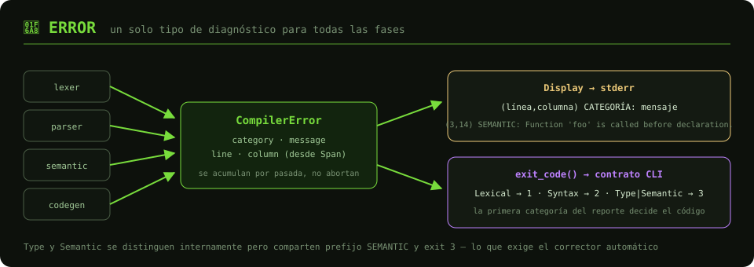
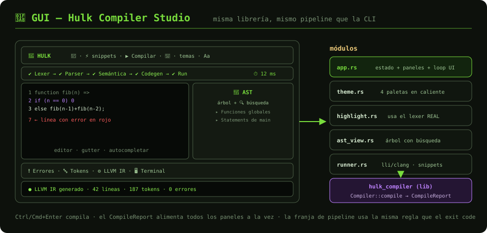

# 🗺️ Mapa de `src/` — Hulk Compiler

Cada módulo tiene su propio README con el flujo detallado y un diagrama SVG
de su pipeline:

| Fase | Módulo | Pipeline |
|------|--------|----------|
| 🔤 Análisis léxico | [`lexer/`](lexer/README.md) |  |
| 🌳 Análisis sintáctico + macros | [`parser/`](parser/README.md) |  |
| 🧠 Análisis semántico | [`semantic/`](semantic/README.md) |  |
| ⚙️ Generación LLVM IR | [`codegen/`](codegen/README.md) |  |
| 🚂 Orquestación | [`compiler/`](compiler/README.md) |  |
| 🚨 Diagnóstico | [`error/`](error/README.md) |  |
| 🎨 GUI | [`bin/gui/`](bin/gui/README.md) |  |

## El pipeline completo

```text
 fuente ──▶ lexer ──▶ parser ──▶ macros ──▶ semantic ──▶ codegen ──▶ clang ──▶ ./output
  .hulk    tokens     AST      AST plano   tablas+tipos   LLVM IR
              │          │         │            │             │
              └──────────┴─────────┴────────────┴─────────────┴──▶ error (fail-fast, exit 1/2/3)
```

Dos invariantes de diseño que atraviesan todo el árbol:

1. **Una sola dirección**: cada fase consume la salida de la anterior y nunca
   la recalcula — en particular, codegen recibe el `SemanticAnalyzer` ya
   corrido (`generate(&program, &analyzer)`).
2. **Un módulo por responsabilidad**: `symbol_collector/`, `type_checker/` y
   `backend/` están partidos por concern; ningún archivo de lógica supera las
   ~400 líneas.

El núcleo se expone como librería (`lib.rs`, crate `hulk_compiler`) compartida
por la CLI ([`main.rs`](main.rs)) y la GUI. La documentación de API completa:
`cargo doc --no-deps --open`.
