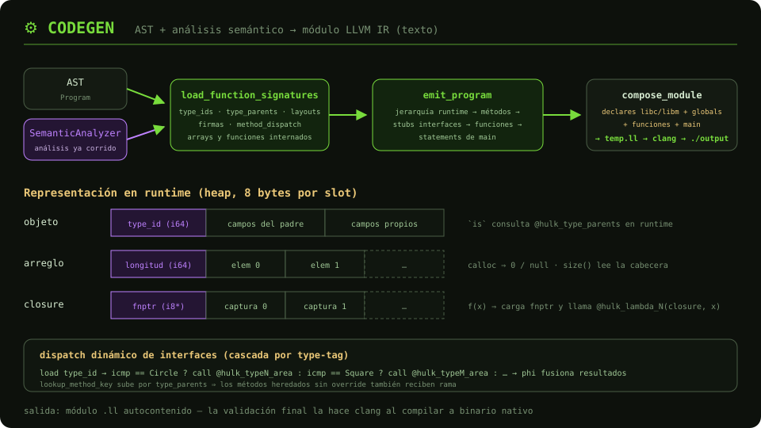

# ⚙️ Codegen — Generación de LLVM IR

Convierte el AST verificado a **LLVM IR en formato texto** (sin `inkwell`):
tres buffers de líneas (globals, funciones, cuerpo de `main`) que se
ensamblan en un módulo `.ll` que `clang` valida y compila.



## Interfaz pública

```rust
pub trait CodegenBackend {
    fn generate(
        &mut self,
        program: &Program,
        analyzer: &SemanticAnalyzer,   // el análisis YA corrido por el Compiler
    ) -> Result<String, Vec<CompilerError>>;
}
```

El backend **no re-analiza nada**: consume las tablas del `SemanticAnalyzer`
que el `Compiler` le pasa — el pipeline fluye en una sola dirección.

## Flujo de `LlvmBackend::generate`

1. `reset()` — limpia todo el estado entre compilaciones.
2. **`load_function_signatures(program, analyzer)`** ([`backend/functions.rs`](llvm/backend/functions.rs)) —
   extrae del análisis: `type_ids`, jerarquía `type_parents` (incluye
   interfaces splat), layouts de structs, firmas (`FunctionInfo`),
   `method_dispatch`, tipos de arreglo y de función internados.
3. **`emit_program`** ([`backend/emit/`](llvm/backend/emit/)) — en orden:
   globals de jerarquía (`@hulk_type_parents` + `@hulk_is_subtype`) →
   métodos de tipos (+ `Range` builtin) → stubs de interfaces → funciones
   globales → statements del `main`.
4. **`compose_module`** ([`helper/module_writer.rs`](llvm/helper/module_writer.rs)) —
   preámbulo de `declare` (libc/libm) + globals + funciones + `main`.

## Estructura del backend (un módulo por responsabilidad)

| Módulo | Rol |
|--------|-----|
| `backend/mod.rs` | Estado del generador + orquestación de `generate` |
| `backend/emitter.rs` | Buffers de texto y nombres frescos (`%tN`, etiquetas) |
| `backend/scopes.rs` | Pila de scopes y almacenamiento (`alloca`/`store`) |
| `backend/type_compat.rs` | Subtipado, nulabilidad, igualdad estructural |
| `backend/functions.rs` | Carga de la metadata semántica |
| `backend/layout.rs` | Layout de structs (`[type_id][padre][propios]`) |
| `backend/type_lowering.rs` | `SemanticType` → `ValueType` + anotaciones |
| `backend/runtime_globals.rs` | `@hulk_type_parents` / `@hulk_is_subtype` |
| `backend/emit/expr/` | Un módulo por variante de expresión |

En `emit/expr/`, la familia de llamadas comparte convenciones
([`call_conventions.rs`](llvm/backend/emit/expr/call_conventions.rs)):
`builtin_call` · `function_call` · `method_call` · `interface_dispatch`
(cascada por type-tag con herencia) · `lambda` + `free_vars` (closures).

## Representación en runtime

| Valor | Layout |
|-------|--------|
| `Number` / `Boolean` | `double` / `i1` |
| Objeto | heap: `[type_id i64][campos del padre][campos propios]` |
| Arreglo | heap: `[i64 longitud][elem0][elem1]…` (8 bytes/elem, `calloc`) |
| Closure | heap: `[fnptr][captura0][captura1]…` (captura por valor) |
| `is` | consulta `@hulk_type_parents` vía `@hulk_is_subtype` en runtime |

`ValueType` modela los tipos emitidos: `Double`, `Bool`, `StringPtr`, `Unit`,
`Null`, `Function(id)`, `Struct(id)`, `Array(id)` — los ids son los
`TypeId` semánticos, así la igualdad estructural se resuelve contra las
mismas tablas que usó el análisis.

**Salida:** módulo `.ll` → `clang -Wno-override-module temp.ll -lm -o output`.
