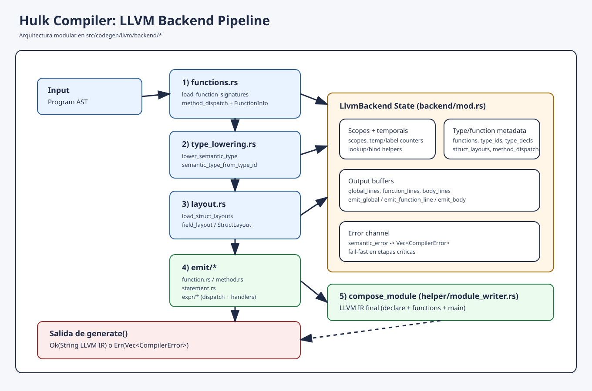

# Codegen

Este módulo convierte el AST validado a LLVM IR.

Backend actual:
- `llvm` (`src/codegen/llvm`)

Interfaz pública:

```rust
pub trait CodegenBackend {
    fn generate(&mut self, program: &Program) -> Result<String, Vec<CompilerError>>;
}
```

## Estructura actual

```text
src/codegen/
  mod.rs
  README.md
  docs/
    pipeline.svg
  llvm/
    mod.rs
    backend/
      mod.rs
      functions.rs
      type_lowering.rs
      layout.rs
      emit/
        mod.rs
        function.rs
        method.rs
        statement.rs
        expr/
          mod.rs
          binary.rs
          block.rs
          call.rs
          destructive_assign.rs
          if_expr.rs
          let_in.rs
          literal.rs
          member_access.rs
          new_expr.rs
          unary.rs
          variable.rs
          while_expr.rs
    helper/
      mod.rs
      state.rs
      module_writer.rs
    tests.rs
```

## Pipeline



`LlvmBackend::generate` ejecuta:

1. `reset()`
2. `load_function_signatures(program)` (`backend/functions.rs`)
3. `emit_program(program)` (`backend/emit/*`)
4. `compose_module()` (`llvm/helper/module_writer.rs`)

Si alguna etapa agrega errores, retorna `Err(Vec<CompilerError>)`.

## Responsabilidades por módulo

- `backend/mod.rs`: estado global, scopes, buffers, contadores y utilidades base.
- `backend/functions.rs`: carga de firmas, `FunctionInfo`, `method_dispatch`.
- `backend/type_lowering.rs`: lowering de tipos semánticos y utilidades de layout (`align_to`, `value_layout`).
- `backend/layout.rs`: `StructLayout`, `FieldLayout`, carga/lookup de layouts.
- `backend/emit/function.rs`: emisión de funciones.
- `backend/emit/method.rs`: emisión de métodos y manejo de `self`.
- `backend/emit/statement.rs`: emisión de statements (`let`, `assign`, `print`, `expr`).
- `backend/emit/expr/*`: emisión por expresión del AST.

## Tipos internos de LLVM

`ValueType` modela los tipos emitidos:
- `Double` (`double`)
- `Bool` (`i1`)
- `StringPtr` (`i8*`)
- `Unit` (`i8`)
- `Function` (`i8*`, reservado)
- `Struct(u32)` (`i8*`, reservado)

`ValueRef` combina:
- `value_type`
- `repr` (registro/constante LLVM)

## Notas

- Semántica sigue siendo la fuente de verdad de tipos.
- El backend mantiene validaciones defensivas para no emitir IR inválido.
- Este refactor es estructural: sin cambios de semántica del lenguaje.
