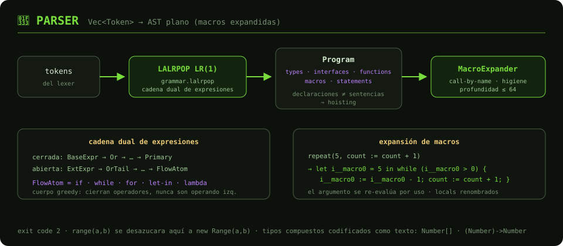

# 🌳 Parser — Análisis Sintáctico

Parser **LR(1)** generado con [LALRPOP](https://lalrpop.github.io/lalrpop/) a
partir de [`grammar.lalrpop`](grammar.lalrpop). Produce el
[AST](expression.rs) y, como paso final, expande las macros `define` para que
las fases siguientes solo vean HULK plano.

## Flujo

1. **Parseo LR(1)** — el stream de tokens se reduce según la gramática. El
   símbolo raíz separa **declaraciones** (`types`, `interfaces`, `functions`,
   `macros`) de las **sentencias** del `main` implícito: esa separación es la
   que habilita el *hoisting* (usar un símbolo antes de declararlo).
2. **Cadena dual de expresiones** — la gramática mantiene una cadena *cerrada*
   (`BaseExpr → … → Primary`) y una *abierta* (`ExtExpr → … → FlowAtom`).
   Las construcciones de cuerpo greedy (`if`, `while`, `let-in`, **lambdas**)
   viven en `FlowAtom`: pueden cerrar una cadena de operadores
   (`5 + if (c) 3 else 10`) pero nunca ser operando izquierdo, lo que
   elimina las ambigüedades de colgado que LALRPOP rechazaría.
3. **Tipos compuestos como texto** — las anotaciones `Number[]` y
   `(Number) -> Number` se codifican canónicamente en el nombre de la
   anotación ([`split_function_type_name`](expression.rs) es el codec
   compartido); el `TypeResolver` semántico las interpreta.
4. **Desazucarado temprano** — `range(a, b)` se convierte aquí en
   `new Range(a, b)`, integrando el built-in al sistema de tipos.
5. **Expansión de macros** — [`macro_expander.rs`](macro_expander.rs)
   sustituye cada llamada a macro por su cuerpo (**call-by-name**: los
   argumentos se re-evalúan en cada uso) renombrando los locals de la macro a
   nombres frescos (**higiene**). Itera con límite de profundidad 64 para
   convertir recursión infinita en error.

## Archivos

| Archivo | Rol |
|---------|-----|
| `grammar.lalrpop` | Gramática LR(1) (~1100 líneas) |
| `expression.rs` | AST completo + codec de tipos función |
| `macro_expander.rs` | Expansión call-by-name higiénica |
| `mod.rs` | Wrapper del parser generado + traducción de errores |

**Salida:** [`Program`](expression.rs) con `macros` ya vacío + errores
sintácticos → exit code `2`.
