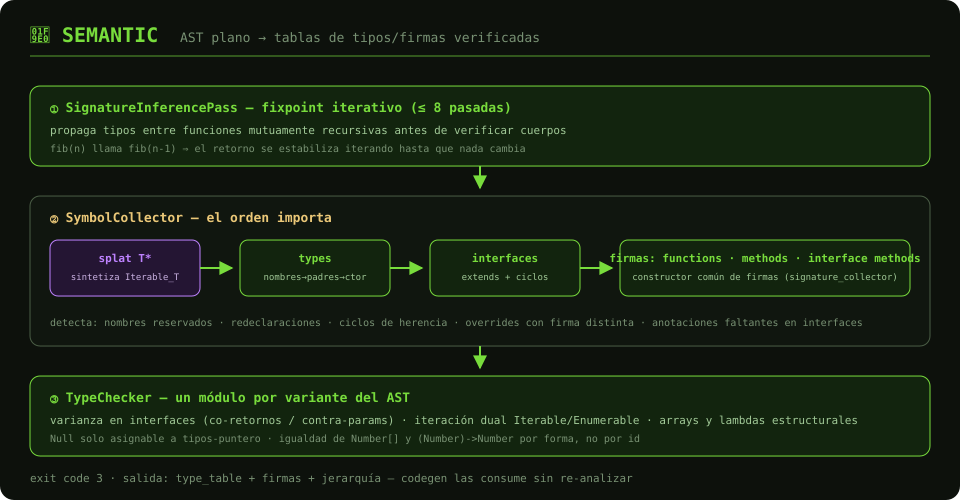

# 🧠 Semantic — Análisis Semántico

Verificación de símbolos y tipos en **dos pasadas** orquestadas por
[`SemanticAnalyzer`](analyzer.rs). El orden de las sub-fases **importa** y
está documentado en [`pipeline/symbol_collector/mod.rs`](pipeline/symbol_collector/mod.rs).

## Flujo

1. **Inferencia de firmas** ([`SignatureInferencePass`](pipeline/signature_inference_pass.rs)) —
   fixpoint iterativo (≤ 8 pasadas) que propaga tipos entre funciones
   mutuamente recursivas *antes* de verificar cuerpos.
2. **Recolección de símbolos** ([`pipeline/symbol_collector/`](pipeline/symbol_collector/)) —
   en orden estricto:
   - `inject_splat_interfaces` — sintetiza `Iterable_T` por cada anotación `T*`.
   - `collect_types` — nombres → padres (ciclos detectados) → params de constructor.
   - `collect_interfaces` — nombres → herencia `extends` validada.
   - `collect_functions` / `collect_methods` / `collect_interface_methods` —
     firmas con un constructor común ([`signature_collector`](pipeline/symbol_collector/signature_collector.rs)).
3. **Verificación de tipos** ([`pipeline/type_checker/`](pipeline/type_checker/)) —
   un módulo por variante del AST. Piezas clave:
   - **Interfaces estructurales** con varianza (covariante en retornos,
     contravariante en parámetros) — [`interface_checker.rs`](pipeline/type_checker/interface_checker.rs).
   - **Iteración dual** `Iterable`/`Enumerable` (análogo a
     `Iterator`/`IntoIterator` de Rust) — [`for_expr_checker.rs`](pipeline/type_checker/for_expr_checker.rs).
   - **Tipos internados estructuralmente**: `Number[]` y `(Number) -> Number`
     comparten `TypeId` si tienen la misma forma ([`type_table.rs`](helper/types_namespace/type_table.rs)).
   - **Nulabilidad selectiva**: `Null` solo es asignable a tipos-puntero
     (`String`, structs, funciones, arreglos).

## Estructura

| Módulo | Rol |
|--------|-----|
| `analyzer.rs` | Orquestación, scopes y tablas (símbolos, firmas, tipos) |
| `pipeline/symbol_collector/` | Recolección — un módulo por responsabilidad (tipos, interfaces, firmas, jerarquía, splat) |
| `pipeline/type_checker/` | Verificación — un módulo por variante de `Expr` |
| `pipeline/signature_inference_pass.rs` | Fixpoint de firmas |
| `pipeline/type_resolver.rs` | Nombres de anotación → tipos (arrays `T[]`, funciones `(A)->B`) |
| `pipeline/type_constraint_engine.rs` | Unificación/propagación (`merge_types`, `constrain_*`) |
| `helper/` | `SemanticType`, `TypeId`, `TypeTable`, `ScopeStack` |
| `builtins.rs` | `Object`, `Range`, `Iterable`, `Enumerable` |

## API pública

- `SemanticAnalyzer::analyze(program, source) -> Vec<CompilerError>`
- Getters de `type_table`, `type_symbols`, `function_symbols`,
  `function_signatures` — **codegen los consume directamente** vía
  `generate(program, &analyzer)`, sin re-analizar.

**Salida:** tablas pobladas + errores → exit code `3`.
