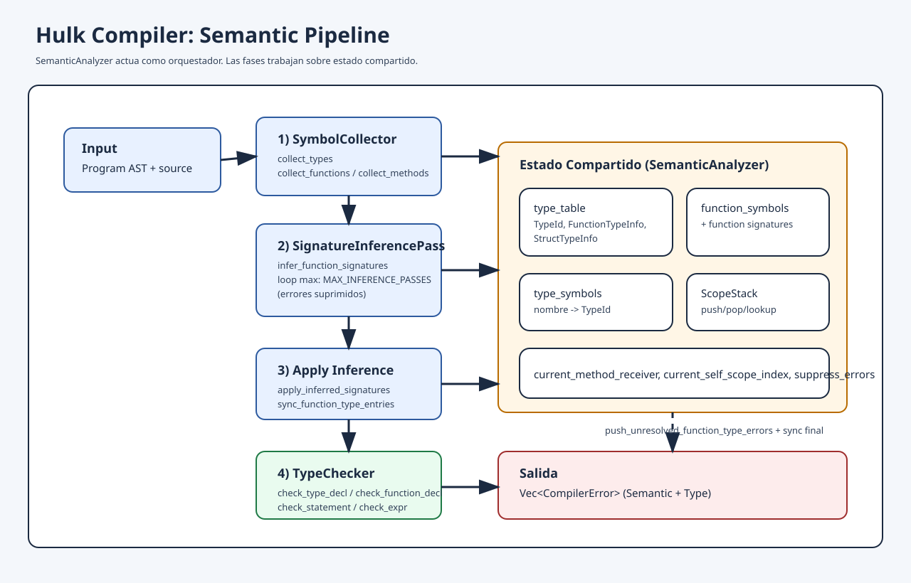

# Semantic

Este módulo implementa el análisis semántico del compilador Hulk.

## Qué valida

- scopes y redeclaraciones
- uso de variables antes de declarar
- compatibilidad de tipos en expresiones
- contratos de funciones y métodos (parámetros y retorno)
- inferencia de tipos sobre firmas incompletas

## Estructura actual

```text
src/semantic/
  mod.rs
  analyzer.rs                  # orquestador del pipeline
  helper/
    mod.rs
    scope.rs
    function.rs
    types_namespace/
      mod.rs
      type_info.rs
      type_table.rs
      types.rs
  pipeline/
    mod.rs
    symbol_collector.rs
    type_resolver.rs
    type_constraint_engine.rs
    type_checker.rs
    signature_inference_pass.rs
  docs/
    pipeline.svg
  tests/
    ...
```

## Flujo del pipeline



Orden de ejecución (sin cambiar semántica externa):

1. `SymbolCollector`
2. `SignatureInferencePass` (loop hasta `MAX_INFERENCE_PASSES`)
3. `apply_inferred_signatures`
4. `TypeChecker`
5. `push_unresolved_function_type_errors` + `sync_function_type_entries`

La API pública se mantiene:

- `SemanticAnalyzer::analyze(program, source) -> Vec<CompilerError>`
- getters de `type_table`, `function_symbols`, `type_symbols`, `function_signatures`

## Responsabilidades por módulo

- `analyzer.rs`: orquestación y estado compartido.
- `pipeline/symbol_collector.rs`: construcción de tablas y símbolos.
- `pipeline/type_resolver.rs`: resolución de tipos (`SemanticType <-> TypeId`).
- `pipeline/type_constraint_engine.rs`: unificación/propagación (`merge_types`, `constrain_*`).
- `pipeline/type_checker.rs`: traversal del AST y validaciones semánticas.
- `pipeline/signature_inference_pass.rs`: inferencia iterativa de firmas.
- `helper/scope.rs`: implementación de `ScopeStack` (sin cambios estructurales).

## Estado compartido principal

`SemanticAnalyzer` centraliza:

- `type_table`
- `function_symbols`
- `type_symbols`
- `functions` (firmas)
- `scopes` (`ScopeStack`)
- `errors`

Las fases operan sobre este estado de forma ordenada para mantener comportamiento consistente.
